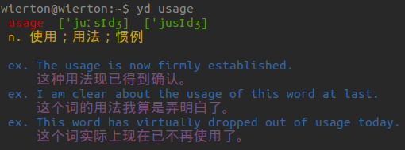

#yd

* introduction
 * A terminal bilingual dictionary by youdao API
* features
 * soundmark, definition, example sentence for English word
 * pinyin and bilingual example sentence for chinese word

### Install
	sudo pip install yd

### Help
```
Input[0]:
yd --help

Output[1]:
yd [options] word

-s, --save-to=[db|disk] designate the place for local cache
-u, --user=[name]       set the user to access local database
-p, --password=[passwd] set the password corresponding to the user name
-h, --help              display the help and exit
-v, --version           output version information and exit
-o, --output=filename   output cached word to file
--reset                 reset to initial state
```

### Usage
* yd --save-to=[db|disk]
 * 'db' means search history will be cached to local database
 * 'disk' means ~/.yd/.cache
* yd -u username -p password
 * provide username and password of your database

### Examples


### Thanks to Flowerowl's work <https://github.com/Flowerowl/ici>
